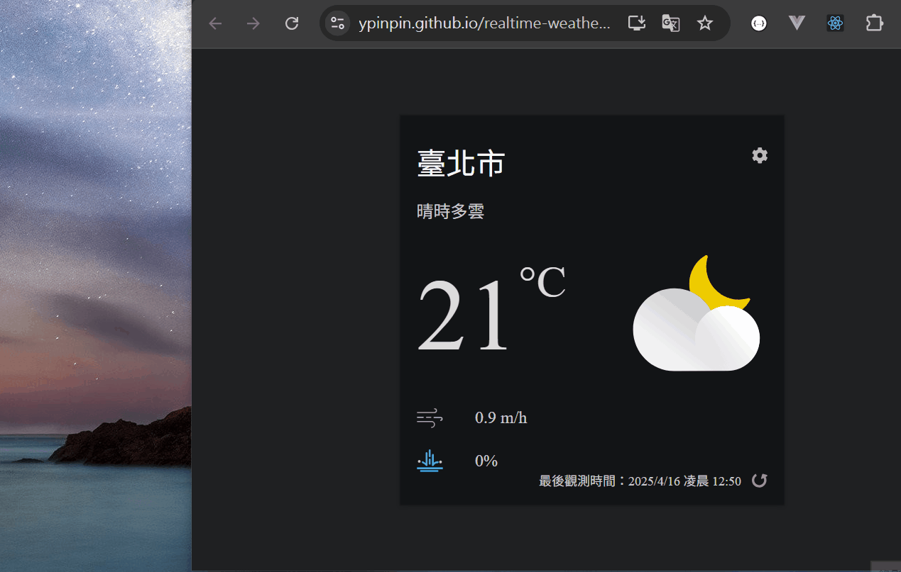

# 臺灣好天氣 App 練習專案

主要根據 [從 Hooks 開始，讓你的網頁 React 起來](https://pjchender.dev/react-bootcamp/) 的 [臺灣好天氣 App 專案](https://pjchender.dev/react-bootcamp/docs/book/ch4/4-1) 教學實作的 React 專案 (使用 CRA 搭配 React 18 版本實作)。

由於 Create React App 已正式被棄用，**此專案主要是為練習撰寫 React 及串接第三方 API 相關功能**。

> [!CAUTION]
>
> ## Deprecated
>
> Today(February 14, 2025), we’re deprecating [Create React App](https://create-react-app.dev/) for new apps, and encouraging existing apps to migrate to a [framework](https://react.dev/learn/creating-a-react-app). We’re also providing docs for when a framework isn’t a good fit for your project, or you prefer to start by [building a framework](https://react.dev/learn/building-a-react-framework). —— [Sunsetting Create React App](https://react.dev/blog/2025/02/14/sunsetting-create-react-app)

## 實作筆記

[ 📖 臺灣好天氣 App 專案實作筆記](https://github.com/YPINPIN/react-bootcamp-note?tab=readme-ov-file#%E8%87%BA%E7%81%A3%E5%A5%BD%E5%A4%A9%E6%B0%A3-app-%E5%B0%88%E6%A1%88%E5%BB%BA%E7%AB%8B%E5%9C%96%E7%A4%BA%E6%AA%94%E6%A1%88%E4%B8%8B%E8%BC%89)

## Demo

[💻 Github Pages](https://ypinpin.github.io/realtime-weather-test/)

也可以在手機上開啟頁面並安裝 App：

- Github Pages QRcode

  

- Demo (Android)

  

- Demo (iOS)

  
